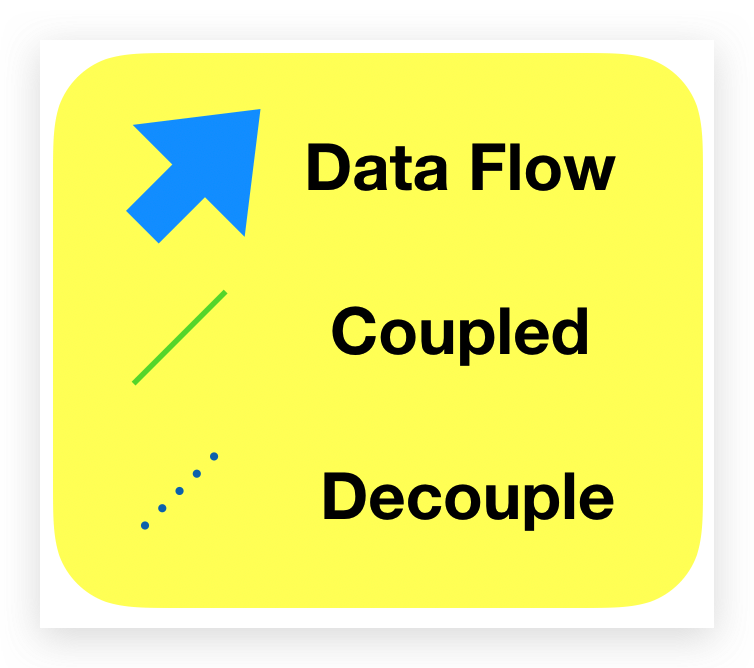
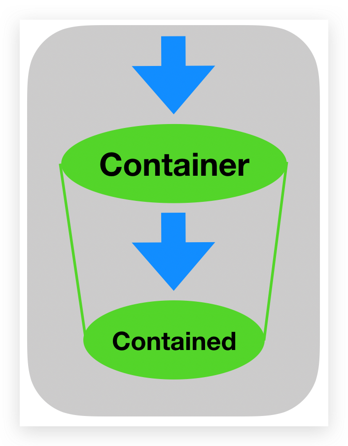
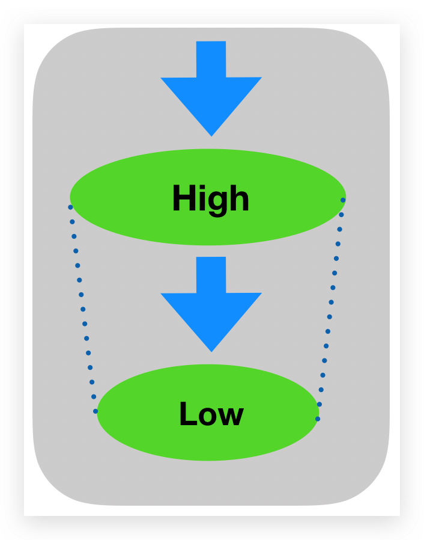
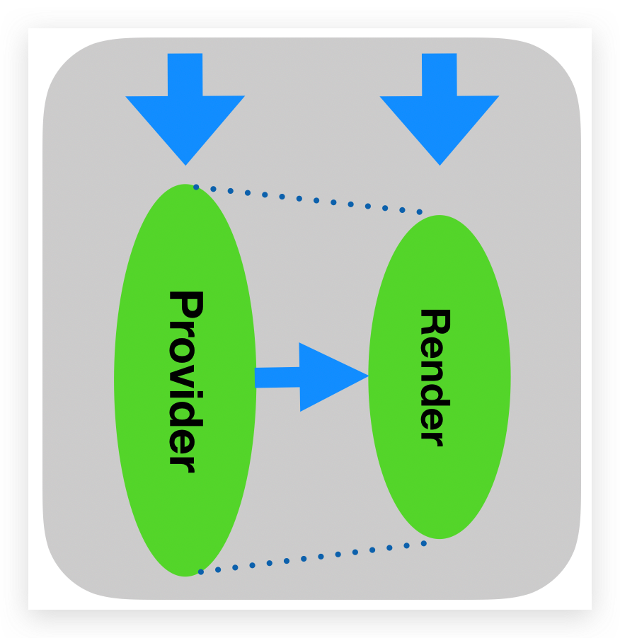
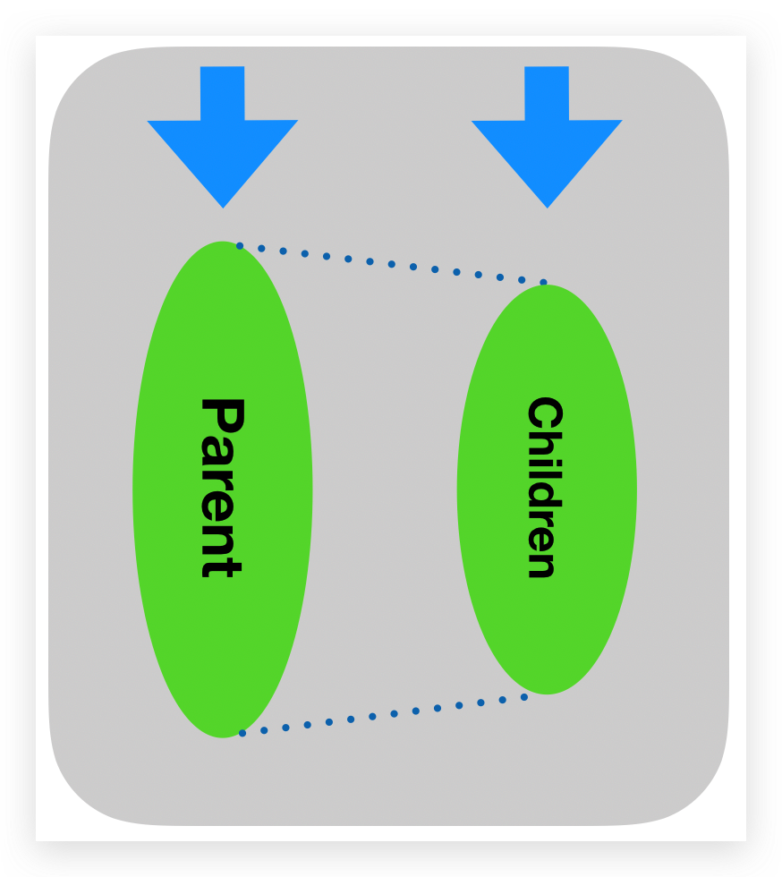

### Memo基础
- **小知识**: **父组件**的重新渲染会引起**子组件**的`props`发生改变, 所以memo默认是`shallow compare`
- **何时使用**: 取消父组件引起的`不必要`子组件渲染时
- **针对对象**: `memo`仅仅针对`props`, 不会干涉子组件的`state`或者`store`或者`context`引起的渲染
- **默认比较方法**: `shallow compare`， 修改:
```javascript
import { memo } from 'react';
const myComponent = (props) => {...}
const areEqual = (prevProps, nextProps) => {...}
export default memo(MyComponent, areEqual);
```

### SmartStrictEqual
- **讨论前提**: **data** is `immutable`
- **注意事项**: **function** is `mutable`
- 引用比较: 针对**0**个`{}`的有效
- [浅比较](https://github.com/facebook/react/blob/v16.8.6/packages/shared/shallowEqual.js): 针对只有**1**个`{}`的对象有效
- [深比较](https://github.com/epoberezkin/fast-deep-equal): 针对**大于1**个`{}`的对象有效

```javascript
import deepEqual from 'fast-deep-equal';
import { equal } from 'fast-shallow-equal';

const getType = (sth) => {
  return Object.prototype.toString.call(sth).slice(8, -1);
}

const deepObject = (obj) => {
  const keys = Object.keys(obj);
  for (let i = 0; i < keys.length; i++) {
    const type = getType(obj[keys[i]]);
    if (type === 'Object' || type === 'Array') return true
  }
  return false
}

export const smartStrictEqual = (prev, next) => {
  const prevType = getType(prev);
  const nextType = getType(next);
  if (prevType !== nextType) return Object.is(prev, next);
  if (prevType === 'Array') return deepEqual(prev, next);
  if (prevType !== 'Object') return Object.is(prev, next)
  if (deepObject(prev) || deepObject(next)) return deepEqual(prev, next)
  return equal(prev, next)
}
```

### memo在组件Composition模式下的失效问题
#### 组合的两种方式
- 作为内部元素
```javascript
// A的re-render会引起B的re-render
const ComponentA = () => (
  <ComponentB/>
)
```
- 作为`props`传入
```javascript
// A的re-render不会引起B的re-render
// App的re-render会引起A和B的re-render
const App = () => (
  <ComponentA>
    <ComponentB/>
  <ComponentA/>
)
```
#### 两者区别
- **内部元素**: A的re-render会引起B的re-render
- **props传入**: 
  - **App**的re-render才会引起**B**的re-render，**A**不会; 
  - **B**的re-render势必引起**A**的re-render, 因为**B**作为`props`传入了**A**
  - 对**A**使用memo是无效的，`因为children中包含函数`，结果一定不同
#### 实例分析
```javascript
const C0 = (props) => {
  return (
    <div>
      C0 Component
      <C1>
          <C2>
            <C3/>
          </C2>
      </C1>
    </div>
  )
}
```
- 背景: 无任何`memo`
  - 问题: `C0` re-render时, 哪些组件会跟着re-render?
  - 分析: `C1`, `C2`, `C3`都会re-render, 因为**字面上**，它们都是`C0`的子组件
- 背景: 除`C0`外全部使用`memo`, 采用`smartStrictEqual`方法
  - 问题: `C0`re-render时, 哪些组件会跟着re-render?
  - 分析:
    - `C3`的`props`中**无**children，使用memo**能阻止**渲染;
    - `C2`的`props`中**有**children，memo**无法**阻止渲染;
    - `C1`的`props`中**有**children, memo**无法**阻止渲染;

### Patterns
<div style="text-align:center; margin:auto"></div>

#### Container Pattern
- 垂直结构设计
- 灰层数据传入需要通过C
<div style="text-align:center; margin:auto weight:auto height:auto max-width: 50% max-height:50%"></div>

#### High Order Component Pattern
<div style="text-align:center; margin:auto"></div>

#### Render Props Pattern
<div style="text-align:center; margin:auto"></div>

#### Composite Component Pattern
<div style="text-align:center; margin:auto"></div>


